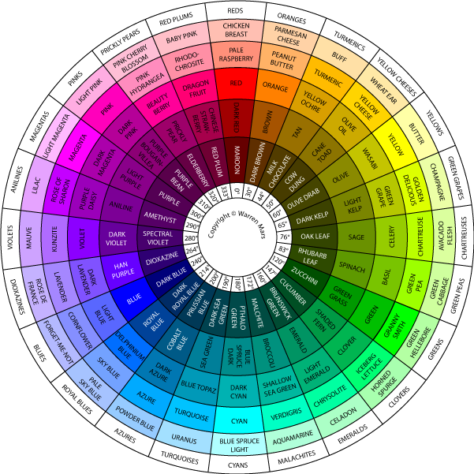
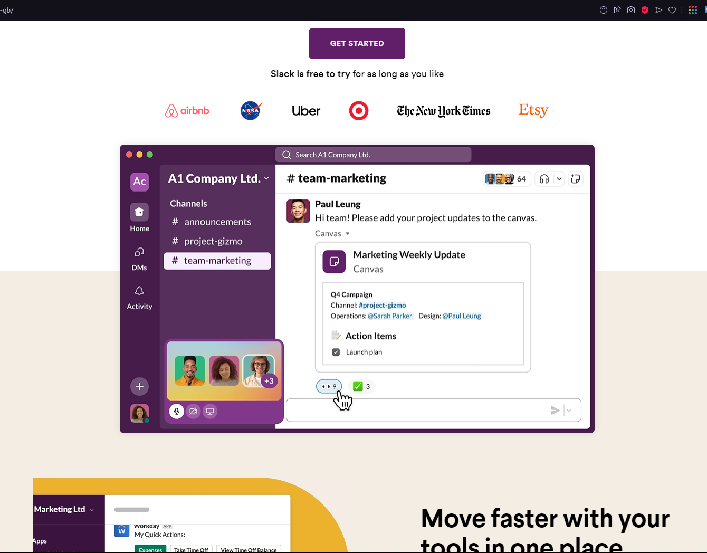
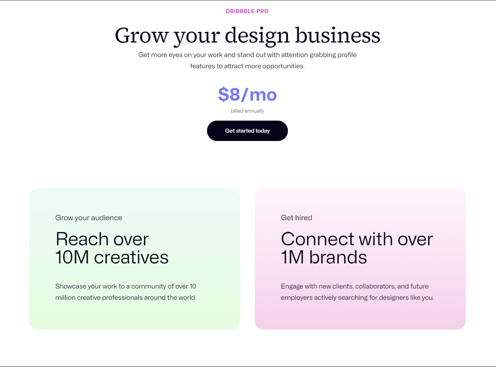

> **Note**: This note contained custom CSS styling. Check the CSS snippets in Obsidian settings.

---
title: Color-Theory
---

#reference #css

created: 1720272116472
updated: 1724443609691
---

## CSS Color Theory

This is a set of rules and guidelines that help you use colors effectively in your designs. It explains how humans perceive colors and how to create harmonious color schemes that work together.

### Color Models

A color model is a mathematical model describing the way colors can be represented as tuples of numbers. The most common color models are RGB, CMYK, HSL, and HSV. In CSS, we use the RGB and HSL color models.

#### RGB Color Model

![[FCC/CSS-Basics#rgb-color-model]]

#### HSL Color Model

![[FCC/CSS-Basics#hsl-color-model]]

### Choosing Colors For Web Design

When choosing colors for your website, you should consider the following: #REVISE

-   <b>Contrast : </b> Contrast can be achieved in many ways, such as using different colors, different shades of the same color, or different levels of brightness. Some principles used to achieve the best contrast are: #RESEARCH

    -   <i>Complementary Colors :</i> Colors that are opposite each other on the color wheel. example: red and green. Though complementary colors are high contrast, they can be difficult to read when used together. It's good practice to use a main color and then use the complementary color for highlights and accents.  [Moz Website](https://moz.com)

    -   <i>Triadic Colors : </i> Colors that are evenly spaced around the color wheel. example: red, yellow, and blue. Triadic colors are also high contrast, but they are more balanced than complementary colors. The challenge is that they can be difficult to use effectively.  [Slack Website](https://slack.com)

    -   <i>Split-Complementary Colors : </i> A variation of the complementary color scheme. In addition to the base color, it uses the two colors adjacent to its complement. example: blue, yellow-orange, and red-orange. The split-complementary color scheme provides high contrast without the strong tension of the complementary color scheme.  [Dribble Website](https://dribbble.com)

    -   <i>Analogous Colors : </i> Colors that are next to each other on the color wheel. example: blue, green, and cyan. Analogous colors are often used in web design to create a sense of harmony and unity. They are similar to each other and can be pleasing to the eye.  [Dropbox Website](https://dropbox.com)